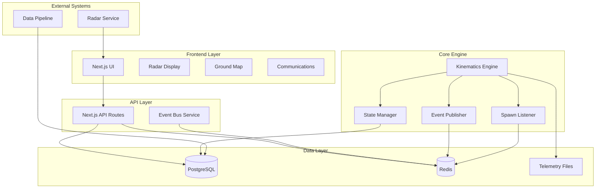
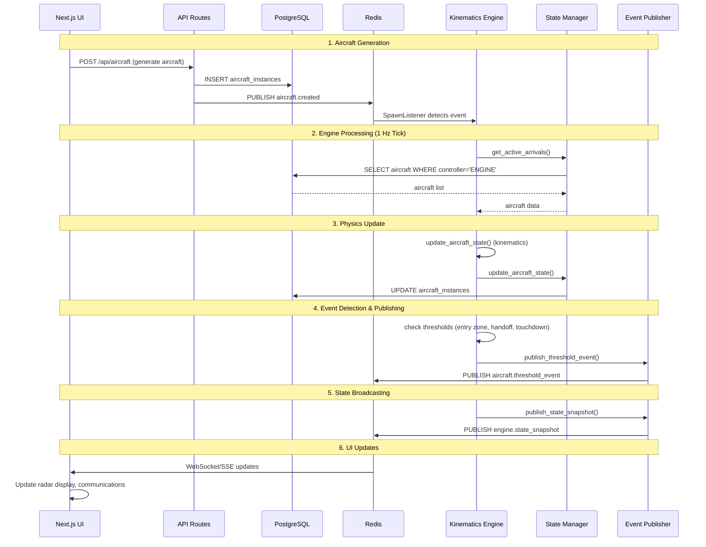

# ATC System Architecture Plan

## Table of Contents
1. [System Overview](#system-overview)
2. [High-Level Architecture](#high-level-architecture)
3. [Core Modules](#core-modules)
4. [Real-Time Event Lifecycle](#real-time-event-lifecycle)
5. [Database Architecture](#database-architecture)
6. [Engine Tick System](#engine-tick-system)
7. [Concurrency Model](#concurrency-model)
8. [Message Flow & Communication](#message-flow--communication)
9. [Data Models](#data-models)
10. [Safety Rules & Validation](#safety-rules--validation)
11. [System Integration](#system-integration)

## System Overview

The ATC (Air Traffic Control) system is a comprehensive real-time simulation platform that manages aircraft operations through multiple AI controllers and a deterministic physics engine. The system operates at 1 Hz tick rate and provides real-time radar displays, communication logs, and ground operations management.

### Key Characteristics
- **Real-time**: 1 Hz deterministic tick system
- **Multi-controller**: ENGINE, ENTRY_ATC, ENROUTE_ATC, APPROACH_ATC, TOWER_ATC
- **Event-driven**: Redis pub/sub for real-time communication
- **Persistent**: PostgreSQL for state storage and historical logging
- **Web-based**: Next.js frontend with real-time updates

## High-Level Architecture



## Core Modules

### 1. Core Engine (`atc-brain-python/engine/`)

The **Kinematics Engine** is the heart of the system, providing deterministic 1 Hz physics simulation.

#### Key Components:
- **`core_engine.py`**: Main orchestrator with tick loop
- **`kinematics.py`**: Physics calculations and motion updates
- **`state_manager.py`**: Database integration and state persistence
- **`event_publisher.py`**: Redis event emission
- **`spawn_listener.py`**: New aircraft detection
- **`geo_utils.py`**: Geographic calculations
- **`airport_data.py`**: Airport reference data
- **`constants.py`**: Physical constants and limits

#### Responsibilities:
- Execute 1 Hz deterministic tick loop
- Apply physics-based aircraft motion
- Emit real-time events via Redis
- Persist state changes to PostgreSQL
- Handle aircraft spawn detection
- Manage sector transitions and handoffs

### 2. ATC Agents (Future Implementation)

Planned AI controllers for different airspace sectors:

- **ENTRY_ATC**: 60-80 NM range, FL200-FL600
- **ENROUTE_ATC**: 10-60 NM range, FL160-FL350  
- **APPROACH_ATC**: 3-10 NM range, SFC-FL180
- **TOWER_ATC**: 0-3 NM range, SFC-3000 ft

### 3. Validator (Built into Engine)

Safety rule enforcement integrated into the kinematics engine:

- **Separation minima**: Distance-based conflict detection
- **Wake turbulence**: Aircraft category-based spacing
- **Performance limits**: Speed, altitude, and turn rate constraints
- **Airspace boundaries**: Sector compliance validation

### 4. Event Bus (`atc-nextjs/lib/eventBus.ts`)

Real-time communication system using Redis pub/sub:

- **Channels**: `atc:events` for system-wide events
- **Message Types**: Aircraft updates, threshold events, system status
- **Subscribers**: UI components, logging systems, external services
- **Publishers**: Engine, API routes, external systems

### 5. Database (`atc-nextjs/database/schema.sql`)

PostgreSQL-based persistence layer:

- **`aircraft_instances`**: Active aircraft state
- **`aircraft_types`**: Reference aircraft performance data
- **`airlines`**: Airline reference information
- **`events`**: Time-ordered event log
- **Indexes**: Optimized for real-time queries

### 6. UI (`atc-nextjs/src/`)

Next.js-based web interface:

- **Radar Display**: Real-time aircraft tracking
- **Ground Map**: Airport layout and ground operations
- **Communications**: ATC radio exchanges
- **Control Panels**: System management interfaces

## Real-Time Event Lifecycle

### Step-by-Step Flow



### Detailed Event Flow

#### 1. Aircraft Generation
```typescript
// User clicks "ADD AIRCRAFT" in UI
POST /api/aircraft
{
  "callsign": "ACA217",
  "aircraft_type": "A320",
  "airline": "AC",
  "flight_type": "ARRIVAL",
  "position": { "lat": 43.85, "lon": -79.80, "altitude_ft": 18000 }
}

// API creates aircraft in database
INSERT INTO aircraft_instances (callsign, position, controller, flight_type)
VALUES ('ACA217', '{"lat":43.85,"lon":-79.80,"altitude_ft":18000}', 'ENGINE', 'ARRIVAL')

// Publish spawn event
PUBLISH atc:events '{"type":"aircraft.created","data":{"callsign":"ACA217",...}}'
```

#### 2. Engine Tick Processing
```python
# Every 1 second (1 Hz)
async def tick(self):
    # Fetch active arrivals controlled by ENGINE
    aircraft_list = await self.state_manager.get_active_arrivals("ENGINE")
    
    for aircraft in aircraft_list:
        # Apply physics updates
        updated_aircraft = update_aircraft_state(aircraft, dt=1.0)
        
        # Update database
        await self.state_manager.update_aircraft_state(
            aircraft["id"], 
            updated_aircraft
        )
        
        # Check for threshold events
        await self.check_and_fire_events(updated_aircraft)
```

#### 3. Event Detection & Publishing
```python
# Check distance thresholds
if distance_nm <= 60.0 and "ENTERED_ENTRY_ZONE" not in last_events:
    await self.event_publisher.publish_threshold_event(
        "ENTERED_ENTRY_ZONE", 
        aircraft,
        {"distance_nm": distance_nm}
    )
    # Update last_event_fired field
    await self.state_manager.update_aircraft_state(
        aircraft["id"],
        {"last_event_fired": "ENTERED_ENTRY_ZONE"}
    )
```

#### 4. UI Real-Time Updates
```typescript
// EventBus subscribes to Redis events
eventBus.subscribe('aircraft.position_updated', (message) => {
  // Update radar display
  updateAircraftPosition(message.data.aircraft);
});

eventBus.subscribe('aircraft.threshold_event', (message) => {
  // Add to communications log
  addCommunicationLog({
    callsign: message.data.aircraft.callsign,
    message: `Entered ${message.data.event_name} zone`,
    timestamp: new Date()
  });
});
```

## Database Architecture

### Schema Design

#### Aircraft Instances Table
```sql
CREATE TABLE aircraft_instances (
    id SERIAL PRIMARY KEY,
    icao24 VARCHAR(6) UNIQUE NOT NULL,           -- ICAO 24-bit address
    registration VARCHAR(10) UNIQUE NOT NULL,    -- Aircraft registration
    callsign VARCHAR(10) UNIQUE NOT NULL,        -- Flight callsign
    aircraft_type_id INTEGER REFERENCES aircraft_types(id),
    airline_id INTEGER REFERENCES airlines(id),
    position JSONB NOT NULL,                     -- {lat, lon, altitude_ft, heading, speed_kts}
    status VARCHAR(20) DEFAULT 'active',         -- active, landed, emergency
    controller VARCHAR(20) DEFAULT 'ENGINE',     -- ENGINE, ENTRY_ATC, etc.
    phase VARCHAR(20) DEFAULT 'CRUISE',          -- CRUISE, DESCENT, APPROACH, etc.
    target_speed_kts INTEGER,                    -- ATC-commanded speed
    target_heading_deg INTEGER,                  -- ATC-commanded heading
    target_altitude_ft INTEGER,                  -- ATC-commanded altitude
    distance_to_airport_nm DECIMAL(8,2),         -- Calculated distance
    last_event_fired VARCHAR(100),               -- Comma-separated event list
    created_at TIMESTAMP DEFAULT NOW(),
    updated_at TIMESTAMP DEFAULT NOW()
);
```

#### Events Table
```sql
CREATE TABLE events (
    id SERIAL PRIMARY KEY,
    timestamp TIMESTAMP DEFAULT NOW(),
    level VARCHAR(10) NOT NULL,                  -- DEBUG, INFO, WARN, ERROR, FATAL
    type VARCHAR(50) NOT NULL,                   -- Event type identifier
    message TEXT NOT NULL,                       -- Human-readable message
    details JSONB,                               -- Additional event data
    aircraft_id INTEGER REFERENCES aircraft_instances(id),
    sector VARCHAR(20),                          -- Controller sector
    frequency VARCHAR(10),                       -- Radio frequency
    direction VARCHAR(10),                       -- TX, RX, CPDLC, XFER, SYS
    created_at TIMESTAMP DEFAULT NOW()
);
```

### Data Synchronization

#### Real-Time State Updates
- **Position Updates**: Every 1 second via engine tick
- **Event Logging**: Immediate when events occur
- **Controller Handoffs**: Atomic database transactions
- **Status Changes**: Immediate with event emission

#### Historical Data
- **Telemetry Files**: JSONL format for detailed flight data
- **Event Logs**: Time-ordered event history
- **Performance Metrics**: Engine statistics and timing data

## Engine Tick System

### 1 Hz Deterministic Loop

```python
class KinematicsEngine:
    async def run(self):
        while self.running:
            tick_start = time.time()
            
            # 1. Fetch active aircraft
            aircraft_list = await self.state_manager.get_active_arrivals("ENGINE")
            
            # 2. Process each aircraft
            for aircraft in aircraft_list:
                # Apply physics
                updated = update_aircraft_state(aircraft, dt=1.0)
                
                # Update database
                await self.state_manager.update_aircraft_state(
                    aircraft["id"], updated
                )
                
                # Check for events
                await self.check_and_fire_events(updated)
            
            # 3. Publish state snapshot (every 10 ticks)
            if self.tick_count % 10 == 0:
                self.event_publisher.publish_state_snapshot(
                    self.tick_count, aircraft_list
                )
            
            # 4. Drift compensation
            elapsed = time.time() - tick_start
            sleep_time = max(0, 1.0 - elapsed)
            await asyncio.sleep(sleep_time)
```

### Physics Calculations

#### Speed Updates
```python
def update_speed(current_speed: float, target_speed: float, dt: float) -> float:
    """Apply acceleration-limited speed changes."""
    diff = target_speed - current_speed
    
    if diff > 0:
        # Acceleration limited to 0.6 kt/s
        max_change = A_ACC_MAX * dt
    else:
        # Deceleration limited to 0.8 kt/s
        max_change = A_DEC_MAX * dt
    
    change = clip(diff, -abs(max_change), abs(max_change))
    return current_speed + change
```

#### Heading Updates
```python
def update_heading(current_heading: float, target_heading: float, 
                  speed_kts: float, dt: float) -> float:
    """Apply bank-angle-limited turn rate."""
    # Calculate maximum turn rate based on speed and bank angle
    max_turn_rate = calculate_max_turn_rate(speed_kts, PHI_MAX_RAD)
    
    # Calculate heading difference (shortest path)
    diff = calculate_heading_diff(current_heading, target_heading)
    
    # Apply turn rate limit
    max_change = max_turn_rate * dt
    change = clip(diff, -max_change, max_change)
    
    return normalize_heading(current_heading + change)
```

#### Position Updates
```python
def update_position(lat: float, lon: float, heading: float, 
                   speed_kts: float, dt: float) -> tuple[float, float]:
    """Update position based on heading and speed."""
    # Convert speed to degrees per second
    speed_deg_per_sec = speed_kts * 1.0 / 60.0  # Approximate conversion
    
    # Calculate new position
    new_lat = lat + speed_deg_per_sec * math.cos(math.radians(heading)) * dt
    new_lon = lon + speed_deg_per_sec * math.sin(math.radians(heading)) * dt
    
    return new_lat, new_lon
```

## Concurrency Model

### Asynchronous Architecture

#### Engine Threading
- **Main Thread**: 1 Hz tick loop
- **Background Tasks**: Spawn listener, event publishing
- **Database Pool**: Async connection pool (5-20 connections)
- **Redis Connections**: Separate pub/sub connections

#### Database Concurrency
```python
# Connection pool configuration
db_config = {
    "min_size": 5,
    "max_size": 20,
    "command_timeout": 30,
    "server_settings": {
        "application_name": "atc_engine"
    }
}

# Concurrent operations
async with self.pool.acquire() as conn:
    # Multiple aircraft can be updated concurrently
    tasks = [
        self.update_aircraft_state(ac["id"], updates)
        for ac in aircraft_list
    ]
    await asyncio.gather(*tasks)
```

#### Event Publishing
- **Non-blocking**: Redis publish operations don't block tick loop
- **Error Handling**: Failed publishes don't stop aircraft processing
- **Batching**: State snapshots published every 10 ticks

### Race Condition Prevention

#### Database Transactions
```sql
-- Atomic aircraft updates
BEGIN;
UPDATE aircraft_instances 
SET position = $1, updated_at = NOW() 
WHERE id = $2;
INSERT INTO events (type, message, aircraft_id) 
VALUES ('position_updated', 'Aircraft position updated', $2);
COMMIT;
```

#### Event Deduplication
```python
# Prevent duplicate events
last_events = aircraft.get("last_event_fired", "").split(",")
if "ENTERED_ENTRY_ZONE" not in last_events:
    # Fire event and update last_event_fired
    await self.fire_event("ENTERED_ENTRY_ZONE", aircraft)
    new_events = last_events + ["ENTERED_ENTRY_ZONE"]
    await self.update_aircraft_state(aircraft["id"], {
        "last_event_fired": ",".join(new_events)
    })
```

## Message Flow & Communication

### Redis Pub/Sub Architecture

#### Event Channels
```typescript
// Primary event channel
const EVENT_CHANNEL = "atc:events";

// Event types
interface EventBusMessage {
  type: string;           // Event type identifier
  timestamp: string;      // ISO timestamp
  data: any;             // Event payload
  event?: Event;         // Optional database event
}
```

#### Message Types

##### Aircraft Events
```typescript
// Position updates
{
  "type": "aircraft.position_updated",
  "data": {
    "aircraft_id": 123,
    "callsign": "ACA217",
    "position": {
      "lat": 43.85,
      "lon": -79.80,
      "altitude_ft": 18000,
      "heading": 230,
      "speed_kts": 280
    }
  }
}

// Threshold events
{
  "type": "aircraft.threshold_event",
  "data": {
    "event_name": "ENTERED_ENTRY_ZONE",
    "aircraft": { /* aircraft data */ },
    "details": {
      "distance_nm": 58.5,
      "threshold_nm": 60.0
    }
  }
}
```

##### System Events
```typescript
// Engine status
{
  "type": "engine.status",
  "data": {
    "tick_count": 12450,
    "aircraft_count": 7,
    "uptime_seconds": 12450,
    "avg_tick_duration_ms": 45
  }
}

// State snapshots
{
  "type": "engine.state_snapshot",
  "data": {
    "tick": 12450,
    "timestamp": "2025-01-12T15:45:00.000Z",
    "aircraft_count": 7,
    "aircraft": [ /* array of aircraft states */ ]
  }
}
```

### WebSocket Integration

#### Real-Time UI Updates
```typescript
// EventBus integration with UI
class ATCSystem {
  componentDidMount() {
    // Subscribe to aircraft events
    eventBus.subscribe('aircraft.position_updated', (message) => {
      this.updateAircraftPosition(message.data);
    });
    
    // Subscribe to threshold events
    eventBus.subscribe('aircraft.threshold_event', (message) => {
      this.addCommunicationLog(message.data);
    });
    
    // Subscribe to system events
    eventBus.subscribe('engine.status', (message) => {
      this.updateSystemStatus(message.data);
    });
  }
}
```

## Data Models

### Aircraft Model

#### Core Aircraft State
```typescript
interface AircraftInstance {
  id: number;                    // Database primary key
  icao24: string;               // ICAO 24-bit address
  registration: string;          // Aircraft registration
  callsign: string;             // Flight callsign
  aircraft_type_id: number;     // Reference to aircraft_types
  airline_id: number;           // Reference to airlines
  
  position: {
    lat: number;                // Latitude (degrees)
    lon: number;                // Longitude (degrees)
    altitude_ft: number;        // Altitude above sea level
    heading: number;            // Heading (degrees, 0-360)
    speed_kts: number;          // Ground speed (knots)
  };
  
  status: 'active' | 'landed' | 'emergency';
  controller: 'ENGINE' | 'ENTRY_ATC' | 'ENROUTE_ATC' | 'APPROACH_ATC' | 'TOWER_ATC';
  phase: 'CRUISE' | 'DESCENT' | 'APPROACH' | 'FINAL' | 'TOUCHDOWN';
  
  // ATC Commands
  target_speed_kts?: number;
  target_heading_deg?: number;
  target_altitude_ft?: number;
  vertical_speed_fpm?: number;
  
  // Calculated fields
  distance_to_airport_nm: number;
  last_event_fired: string;     // Comma-separated event list
  
  // Timestamps
  created_at: Date;
  updated_at: Date;
}
```

#### Aircraft Type Reference
```typescript
interface AircraftType {
  id: number;
  icao_type: string;           // e.g., "A320", "B738"
  wake: string;                // Wake turbulence category (H, M, L)
  engines: {
    count: number;
    type: string;              // e.g., "TURBOFAN"
  };
  dimensions: {
    length_ft: number;
    wingspan_ft: number;
    height_ft: number;
  };
  mtow_kg: number;             // Maximum takeoff weight
  cruise_speed_kts: number;
  max_speed_kts: number;
  range_nm: number;
  ceiling_ft: number;
  climb_rate_fpm: number;
  takeoff_ground_run_ft: number;
  landing_ground_roll_ft: number;
  engine_thrust_lbf: number;
}
```

### ATC Command Model

#### Command Structure
```typescript
interface ATCCommand {
  id: string;                  // Unique command identifier
  aircraft_id: number;         // Target aircraft
  controller: string;          // Issuing controller
  command_type: 'SPEED' | 'HEADING' | 'ALTITUDE' | 'HANDOFF';
  
  // Command parameters
  target_value: number;        // Target speed/heading/altitude
  reason: string;              // Command justification
  priority: 'NORMAL' | 'URGENT' | 'EMERGENCY';
  
  // Execution tracking
  status: 'PENDING' | 'EXECUTING' | 'COMPLETED' | 'REJECTED';
  issued_at: Date;
  executed_at?: Date;
  completed_at?: Date;
  
  // Validation
  validation_result?: {
    valid: boolean;
    errors: string[];
    warnings: string[];
  };
}
```

#### Command Validation
```python
def validate_atc_command(command: ATCCommand, aircraft: AircraftInstance) -> ValidationResult:
    """Validate ATC command against safety rules."""
    errors = []
    warnings = []
    
    # Speed validation
    if command.command_type == 'SPEED':
        if command.target_value < 140 or command.target_value > 550:
            errors.append("Speed outside operational envelope")
        
        # Check acceleration limits
        current_speed = aircraft.position.speed_kts
        speed_diff = abs(command.target_value - current_speed)
        if speed_diff > 50:  # Large speed change
            warnings.append("Large speed change may cause passenger discomfort")
    
    # Heading validation
    elif command.command_type == 'HEADING':
        if command.target_value < 0 or command.target_value >= 360:
            errors.append("Invalid heading value")
        
        # Check turn rate feasibility
        current_heading = aircraft.position.heading
        turn_angle = calculate_turn_angle(current_heading, command.target_value)
        max_turn_rate = calculate_max_turn_rate(aircraft.position.speed_kts)
        if turn_angle / max_turn_rate > 30:  # More than 30 seconds to complete turn
            warnings.append("Large heading change will take significant time")
    
    # Altitude validation
    elif command.command_type == 'ALTITUDE':
        if command.target_value < 0 or command.target_value > 60000:
            errors.append("Altitude outside operational envelope")
        
        # Check vertical speed limits
        current_alt = aircraft.position.altitude_ft
        alt_diff = command.target_value - current_alt
        if abs(alt_diff) > 10000:  # Large altitude change
            warnings.append("Large altitude change may cause passenger discomfort")
    
    return ValidationResult(
        valid=len(errors) == 0,
        errors=errors,
        warnings=warnings
    )
```

### Simulation Event Model

#### Event Structure
```typescript
interface SimulationEvent {
  id: number;                  // Database primary key
  timestamp: Date;             // Event occurrence time
  level: 'DEBUG' | 'INFO' | 'WARN' | 'ERROR' | 'FATAL';
  type: string;                // Event type identifier
  message: string;             // Human-readable message
  details: any;                // Additional event data
  
  // Optional references
  aircraft_id?: number;        // Related aircraft
  sector?: string;             // Controller sector
  frequency?: string;          // Radio frequency
  direction: 'TX' | 'RX' | 'CPDLC' | 'XFER' | 'SYS';
  
  created_at: Date;
}
```

#### Event Types
```typescript
// Aircraft events
type AircraftEventType = 
  | 'aircraft.created'
  | 'aircraft.position_updated'
  | 'aircraft.status_changed'
  | 'aircraft.threshold_event'
  | 'aircraft.handoff'
  | 'aircraft.landed';

// Threshold events
type ThresholdEventType =
  | 'ENTERED_ENTRY_ZONE'      // 60 NM from airport
  | 'HANDOFF_READY'           // 20 NM from airport
  | 'TOUCHDOWN'               // < 50 ft AGL
  | 'SECTOR_TRANSITION';      // Crossed sector boundary

// System events
type SystemEventType =
  | 'engine.status'
  | 'engine.state_snapshot'
  | 'system.startup'
  | 'system.shutdown'
  | 'database.error'
  | 'redis.error';
```

## Safety Rules & Validation

### Separation Minima

#### Horizontal Separation
```python
# Minimum separation distances (nautical miles)
SEPARATION_MINIMA = {
    'H': 6.0,    # Heavy aircraft (A380, B747, etc.)
    'M': 5.0,    # Medium aircraft (A320, B737, etc.)
    'L': 3.0,    # Light aircraft (Cessna, etc.)
}

def check_horizontal_separation(aircraft1: AircraftInstance, 
                              aircraft2: AircraftInstance) -> bool:
    """Check if aircraft maintain minimum horizontal separation."""
    distance = calculate_distance(
        aircraft1.position.lat, aircraft1.position.lon,
        aircraft2.position.lat, aircraft2.position.lon
    )
    
    # Get wake turbulence categories
    wake1 = get_aircraft_wake_category(aircraft1.aircraft_type_id)
    wake2 = get_aircraft_wake_category(aircraft2.aircraft_type_id)
    
    # Use the larger separation requirement
    min_separation = max(
        SEPARATION_MINIMA.get(wake1, 3.0),
        SEPARATION_MINIMA.get(wake2, 3.0)
    )
    
    return distance >= min_separation
```

#### Vertical Separation
```python
# Minimum vertical separation (feet)
VERTICAL_SEPARATION_MINIMA = {
    'FL290_and_above': 2000,  # 2000 ft above FL290
    'FL290_and_below': 1000,  # 1000 ft below FL290
}

def check_vertical_separation(aircraft1: AircraftInstance, 
                            aircraft2: AircraftInstance) -> bool:
    """Check if aircraft maintain minimum vertical separation."""
    alt1 = aircraft1.position.altitude_ft
    alt2 = aircraft2.position.altitude_ft
    alt_diff = abs(alt1 - alt2)
    
    # Determine separation requirement based on altitude
    if max(alt1, alt2) >= 29000:  # FL290 and above
        min_separation = VERTICAL_SEPARATION_MINIMA['FL290_and_above']
    else:
        min_separation = VERTICAL_SEPARATION_MINIMA['FL290_and_below']
    
    return alt_diff >= min_separation
```

### Wake Turbulence Rules

#### Wake Categories
```python
WAKE_TURBULENCE_CATEGORIES = {
    'A380': 'H',      # Heavy
    'B747': 'H',      # Heavy
    'B777': 'H',      # Heavy
    'A320': 'M',      # Medium
    'B737': 'M',      # Medium
    'A319': 'M',      # Medium
    'C172': 'L',      # Light
    'C152': 'L',      # Light
}

# Wake turbulence separation (nautical miles)
WAKE_SEPARATION = {
    ('H', 'H'): 4.0,  # Heavy following Heavy
    ('H', 'M'): 6.0,  # Heavy following Medium
    ('H', 'L'): 8.0,  # Heavy following Light
    ('M', 'H'): 4.0,  # Medium following Heavy
    ('M', 'M'): 3.0,  # Medium following Medium
    ('M', 'L'): 5.0,  # Medium following Light
    ('L', 'H'): 6.0,  # Light following Heavy
    ('L', 'M'): 4.0,  # Light following Medium
    ('L', 'L'): 3.0,  # Light following Light
}
```

### Performance Limits

#### Speed Limits
```python
# Speed constraints (knots)
SPEED_LIMITS = {
    'min_cruise': 140,      # Minimum cruise speed
    'max_cruise': 550,      # Maximum cruise speed
    'approach': 180,        # Maximum approach speed
    'final': 160,           # Maximum final approach speed
    'landing': 140,         # Maximum landing speed
}

# Acceleration limits (kts/s)
ACCELERATION_LIMITS = {
    'max_acceleration': 0.6,    # Maximum acceleration
    'max_deceleration': 0.8,    # Maximum deceleration
}
```

#### Turn Rate Limits
```python
def calculate_max_turn_rate(speed_kts: float, bank_angle_rad: float) -> float:
    """Calculate maximum turn rate based on speed and bank angle."""
    # Turn rate = g * tan(φ) / V
    # where g = gravity, φ = bank angle, V = velocity
    G = 9.80665  # m/s²
    speed_ms = speed_kts * 0.514444  # Convert knots to m/s
    
    max_turn_rate_rad_per_sec = G * math.tan(bank_angle_rad) / speed_ms
    max_turn_rate_deg_per_sec = math.degrees(max_turn_rate_rad_per_sec)
    
    return max_turn_rate_deg_per_sec
```

#### Altitude Limits
```python
# Altitude constraints (feet)
ALTITUDE_LIMITS = {
    'min_altitude': 0,           # Ground level
    'max_altitude': 60000,       # Maximum operational altitude
    'approach_altitude': 3000,   # Standard approach altitude
    'pattern_altitude': 1000,    # Traffic pattern altitude
}

# Vertical speed limits (fpm)
VERTICAL_SPEED_LIMITS = {
    'max_climb_cruise': 2500,    # Maximum climb rate (cruise)
    'max_climb_approach': 1800,  # Maximum climb rate (approach)
    'max_descent_cruise': 3000,  # Maximum descent rate (cruise)
    'max_descent_approach': 1800, # Maximum descent rate (approach)
}
```

### Conflict Detection

#### Real-Time Conflict Detection
```python
async def detect_conflicts(aircraft_list: List[AircraftInstance]) -> List[Conflict]:
    """Detect potential conflicts between aircraft."""
    conflicts = []
    
    # Check all pairs of aircraft
    for i, aircraft1 in enumerate(aircraft_list):
        for aircraft2 in aircraft_list[i+1:]:
            # Check horizontal separation
            if not check_horizontal_separation(aircraft1, aircraft2):
                conflicts.append(Conflict(
                    type='HORIZONTAL_SEPARATION',
                    aircraft1=aircraft1.id,
                    aircraft2=aircraft2.id,
                    severity='HIGH',
                    message=f"Aircraft {aircraft1.callsign} and {aircraft2.callsign} "
                           f"violate horizontal separation minima"
                ))
            
            # Check vertical separation
            if not check_vertical_separation(aircraft1, aircraft2):
                conflicts.append(Conflict(
                    type='VERTICAL_SEPARATION',
                    aircraft1=aircraft1.id,
                    aircraft2=aircraft2.id,
                    severity='HIGH',
                    message=f"Aircraft {aircraft1.callsign} and {aircraft2.callsign} "
                           f"violate vertical separation minima"
                ))
    
    return conflicts
```

## System Integration

### Component Integration

#### Engine-UI Integration
```typescript
// Real-time data flow from engine to UI
class ATCSystem {
  private eventBus: EventBus;
  private aircraft: Map<number, AircraftInstance> = new Map();
  
  constructor() {
    this.eventBus = new EventBus(redis, redisPublisher);
    this.setupEventHandlers();
  }
  
  private setupEventHandlers() {
    // Position updates
    this.eventBus.subscribe('aircraft.position_updated', (message) => {
      const aircraft = message.data.aircraft;
      this.aircraft.set(aircraft.id, aircraft);
      this.updateRadarDisplay();
    });
    
    // Threshold events
    this.eventBus.subscribe('aircraft.threshold_event', (message) => {
      this.addCommunicationLog({
        callsign: message.data.aircraft.callsign,
        message: `Entered ${message.data.event_name} zone`,
        timestamp: new Date(),
        sector: message.data.aircraft.controller
      });
    });
    
    // System status
    this.eventBus.subscribe('engine.status', (message) => {
      this.updateSystemStatus(message.data);
    });
  }
}
```

#### Database-Engine Integration
```python
# State synchronization between engine and database
class StateManager:
    async def sync_aircraft_state(self, aircraft: AircraftInstance) -> bool:
        """Synchronize aircraft state with database."""
        try:
            # Update aircraft position and status
            await self.update_aircraft_state(aircraft.id, {
                'position': aircraft.position,
                'controller': aircraft.controller,
                'phase': aircraft.phase,
                'distance_to_airport_nm': aircraft.distance_to_airport_nm,
                'last_event_fired': aircraft.last_event_fired
            })
            
            # Log position update event
            await self.create_event({
                'level': 'INFO',
                'type': 'aircraft.position_updated',
                'message': f"Aircraft {aircraft.callsign} position updated",
                'aircraft_id': aircraft.id,
                'sector': aircraft.controller,
                'direction': 'SYS'
            })
            
            return True
            
        except Exception as e:
            print(f"Error syncing aircraft state: {e}")
            return False
```

### External System Integration

#### Data Pipeline Integration
```python
# Aircraft type and airline data from pipeline
class DataPipelineIntegration:
    def __init__(self, db_connection):
        self.db = db_connection
    
    async def sync_aircraft_types(self):
        """Sync aircraft types from data pipeline."""
        # Load aircraft types from pipeline output
        with open('data-pipeline/dist/aircraft_types.json') as f:
            aircraft_types = json.load(f)
        
        for aircraft_type in aircraft_types:
            await self.db.execute("""
                INSERT INTO aircraft_types (icao_type, wake, engines, ...)
                VALUES ($1, $2, $3, ...)
                ON CONFLICT (icao_type) DO UPDATE SET ...
            """, aircraft_type['icao_type'], aircraft_type['wake'], ...)
    
    async def sync_airlines(self):
        """Sync airline data from data pipeline."""
        with open('data-pipeline/dist/airlines.json') as f:
            airlines = json.load(f)
        
        for airline in airlines:
            await self.db.execute("""
                INSERT INTO airlines (name, icao, iata, ...)
                VALUES ($1, $2, $3, ...)
                ON CONFLICT (icao) DO UPDATE SET ...
            """, airline['name'], airline['icao'], airline['iata'], ...)
```

#### Radar Service Integration
```python
# Integration with radar service for map generation
class RadarServiceIntegration:
    def __init__(self, radar_service_url: str):
        self.radar_service_url = radar_service_url
    
    async def generate_radar_map(self, aircraft_list: List[AircraftInstance]) -> str:
        """Generate radar map with current aircraft positions."""
        payload = {
            'aircraft': [
                {
                    'callsign': ac.callsign,
                    'position': ac.position,
                    'controller': ac.controller,
                    'phase': ac.phase
                }
                for ac in aircraft_list
            ]
        }
        
        async with httpx.AsyncClient() as client:
            response = await client.post(
                f"{self.radar_service_url}/generate_map",
                json=payload
            )
            return response.text  # Returns HTML for radar display
```

### Deployment Architecture

#### Development Environment
```yaml
# docker-compose.yml
version: '3.8'
services:
  postgres:
    image: postgres:15
    environment:
      POSTGRES_DB: atc_system
      POSTGRES_USER: atc_user
      POSTGRES_PASSWORD: atc_password
    ports:
      - "5432:5432"
    volumes:
      - postgres_data:/var/lib/postgresql/data
  
  redis:
    image: redis:7-alpine
    ports:
      - "6379:6379"
    volumes:
      - redis_data:/data
  
  atc-engine:
    build: ./atc-brain-python
    environment:
      DB_HOST: postgres
      REDIS_HOST: redis
    depends_on:
      - postgres
      - redis
    volumes:
      - ./atc-brain-python/telemetry:/app/telemetry
  
  atc-ui:
    build: ./atc-nextjs
    environment:
      DB_HOST: postgres
      REDIS_HOST: redis
    ports:
      - "3000:3000"
    depends_on:
      - postgres
      - redis
```

#### Production Considerations
- **Load Balancing**: Multiple engine instances with Redis clustering
- **Database Scaling**: Read replicas for UI queries, master for engine writes
- **Monitoring**: Prometheus metrics for engine performance
- **Logging**: Centralized logging with ELK stack
- **Backup**: Automated database backups and telemetry archival

---

This architecture provides a comprehensive foundation for a real-time ATC simulation system with deterministic physics, event-driven communication, and robust data persistence. The modular design allows for easy extension with additional ATC agents and enhanced safety validation systems.
